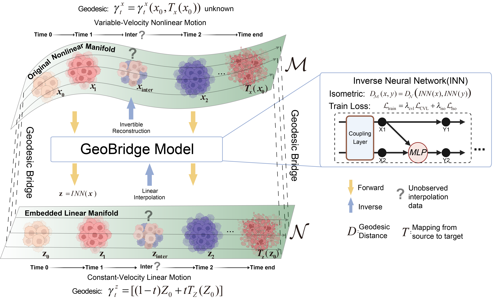
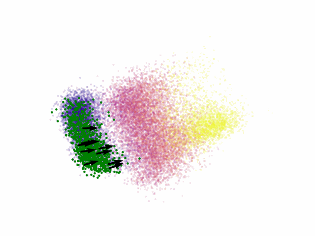
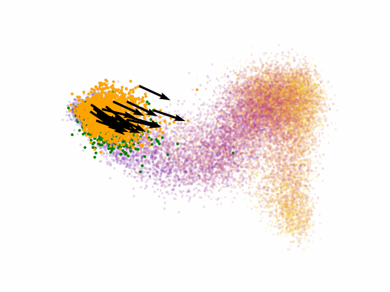
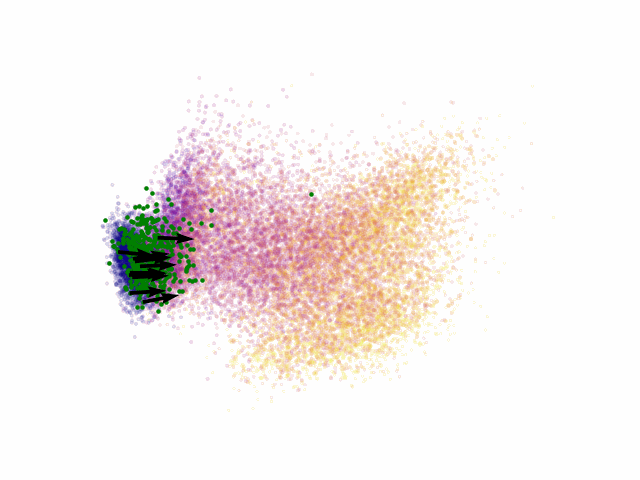
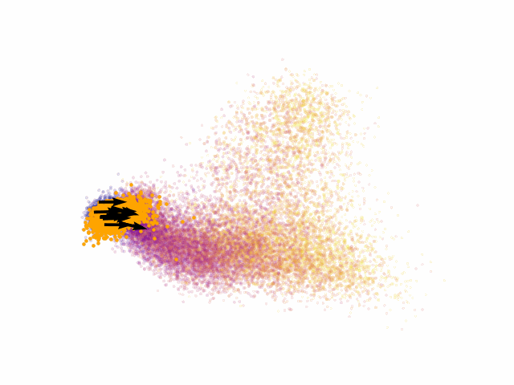

# GeoBridge
 Generating and navigating single cell dynamics via a geodesic bridge between nonlinear transcriptional and linear latent manifolds

## Geodesics path of EMT(green)-MET(orange) progression
| original nonlinear manifold | latent linear manifold (EMT) | latent linear manifold (MET) |
|:----------------------------:|:-----------------------------:|:-----------------------------:|
|  |  |  |
## Geodesics path of Beta(green)-Ec(orange) progression
| original nonlinear manifold | latent linear manifold (Beta) | latent linear manifold (Ec) |
|:----------------------------:|:-----------------------------:|:-----------------------------:|
|  |  |  |
## Installation 🧩
### 1️⃣ Create a new Conda environment
```
conda create -n GeoBridge python=3.9
conda activate GeoBridge
```
### 2️⃣ Install the FrEIA dependency
```
pip install git+https://github.com/vislearn/FrEIA.git
```

### 3️⃣ Clone the GeoBridge repository
```
git clone https://github.com/Zhu-JC/GeoBridge.git
cd GeoBridge
```

### 4️⃣ Install additional dependencies
```
pip install -r requirements.txt
```
## Usage 🚀
### Train GeoBridge model of time-resolved data 🧪
```
python train/GeoBridge_train.py --model MET
python train/GeoBridge_train.py --model EMT
```
### Downstream analysis 📈
```
python downstream_analysis/EMT_MET_analysis.py
```
### Train GeoBridge model of single-snapshot data by *Pseudotime* initialization 🧪
```
python train/Pseudotime_train.py --model EMT --interval 100 --num_cluster 5
```
### Downstream analysis of single-snapshot data 📈
```
python downstream_analysis/EMT_pseudotime_analysis.py
```
### Do heldout test 🔍
```
python train/Heldout_train.py --model EMT --heldout 12
```
## Project Structure 🌈
GeoBridge/

├── train/                   
├── downstream_analysis/    
├── data/                   
├── results/    
├── requirements.txt         
└── README.md                
## Contact
📧Email: zhujunchao2022@sibcb.ac.cn
